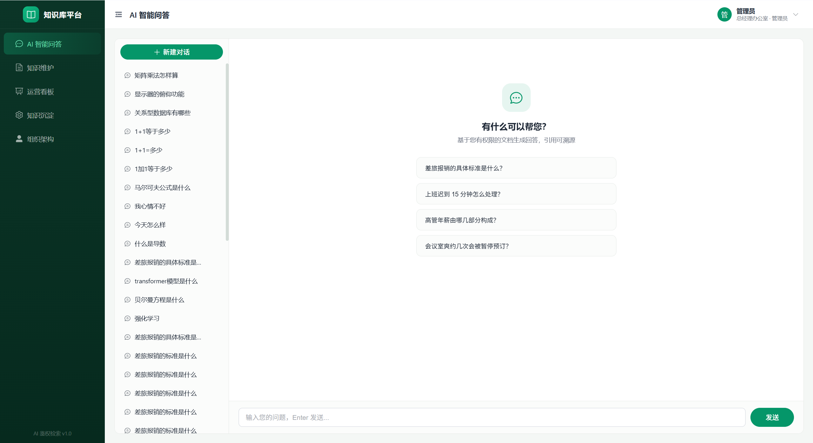
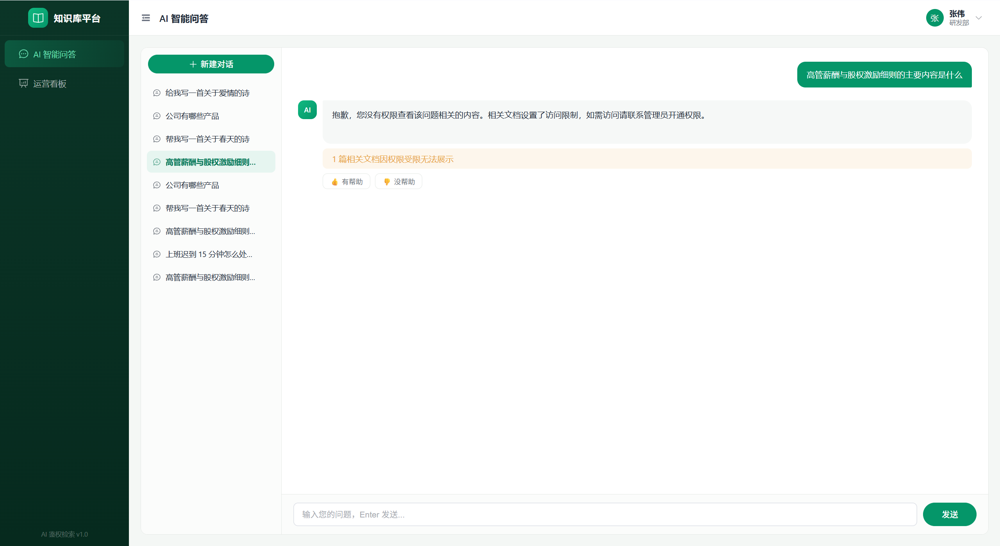
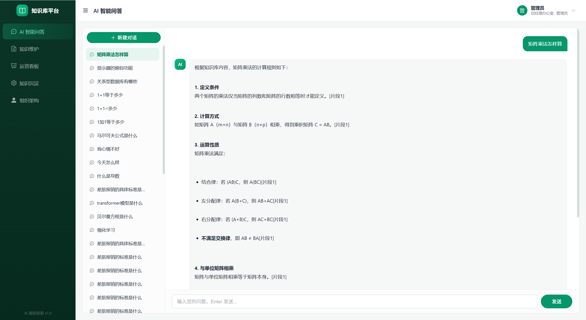
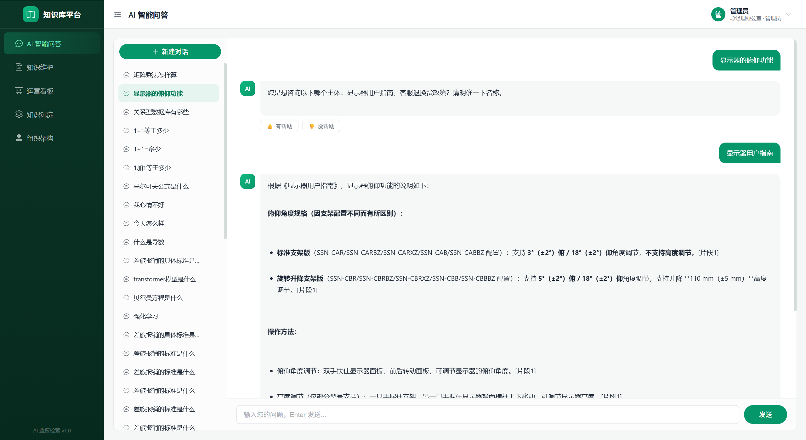
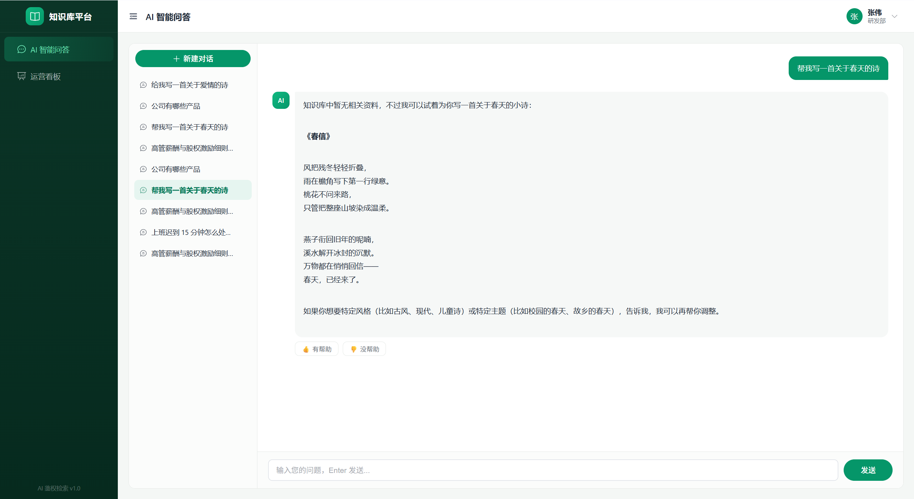
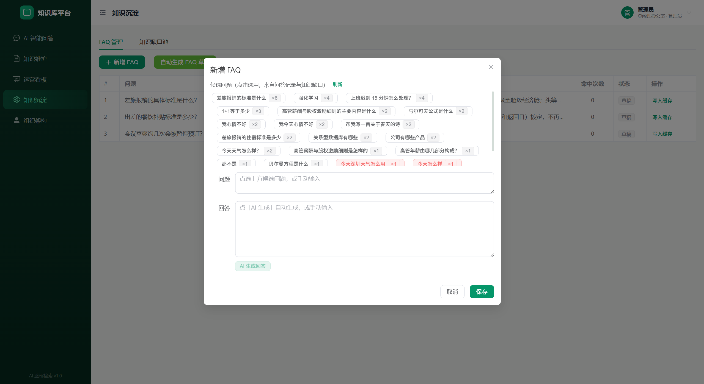
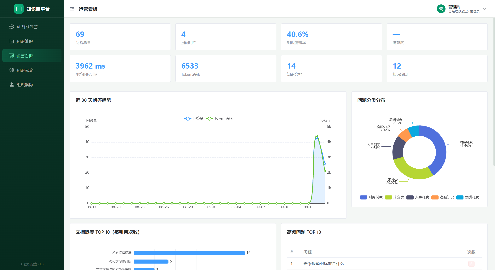
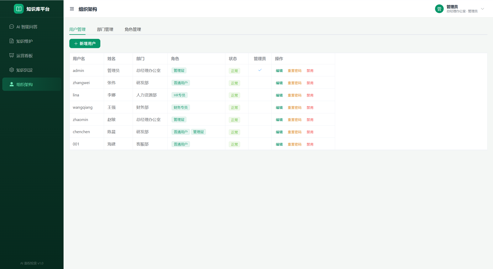
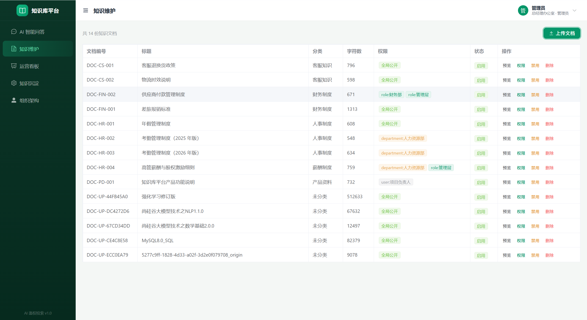

# 企业知识库智能问答平台（kb-platform）

带**四维细粒度权限鉴权**的 RAG 知识库系统：文档多源维护 → 权限管控 → AI 鉴权检索问答 → 数据运营沉淀，全链路覆盖。



**测试账号**（首次 `seed` 初始化后可用）：

| 账号 | 密码 | 角色 | 权限特点 |
|------|------|------|----------|
| `admin` | `admin123` | 管理员（管理层） | 可见高管薪酬等管理层文档 |
| `zhangwei` | `user123` | 研发部普通员工 | 全局文档 + 研发部文档 |
| `lina` | `user123` | HR 专员 | 全局文档 + HR 部门文档 |

---

## 核心特性

### 1. 四维细粒度权限鉴权（项目最大亮点）
每篇文档可配置 **全局 / 部门 / 角色 / 个人** 四个维度的访问权限，OR 逻辑任一满足即可见：
- 权限过滤**下沉到 Milvus 检索表达式**，无权内容在检索层就被排除，不出现在任何中间结果
- 用户问到无权访问的内容时，通过无权限探测检索确认"内容存在但受限"，明确提示无权限查看（不泄露文档名与内容）
- 权限更新时**数据库与 Milvus 标量字段双写同步**，立即生效

研发部员工询问仅 HR 部/管理层可见的《高管薪酬与股权激励细则》时：



### 2. AI 鉴权问答（SSE 流式）
- RAG 链路：FAQ 缓存命中 → 向量检索 → 权限过滤 → Prompt 编排 → LLM 流式生成 → 后处理约束
- **引用溯源**：每个关键结论标注来源片段 `[片段N]`，前端可查引用清单

  

- **幻觉约束**：系统指令强制"仅依据检索资料回答，数字条款原文引用"，多版本冲突时分别列出版本与适用时间
- **实体反问**：问题命中的主体有歧义时（如"显示器的俯仰功能"命中多份文档），先反问确认再回答，避免答错文档

  

- **澄清功能**：无关问题（天气/闲聊/写诗等）**先回答再澄清**——分数门控（top score ≥ 0.70 直接走 RAG）+ LLM 意图分类混合判定，避免误伤低分的真实业务问题

  

### 3. FAQ 缓存（Redis + 权限复核）
高频问题答案缓存到 Redis，命中时先对**全部来源文档做权限复核**，无权则降级走完整检索链路，缓存与安全两不误。

### 4. 知识缺口挖掘
检索无结果 / 无权访问的问题自动记入缺口池，运营侧可聚类分析高频缺口，反哺知识库建设。

### 5. FAQ 沉淀与数据运营看板
- **FAQ 沉淀**：从问答记录与知识缺口中点选候选问题，AI 自动生成回答，一键写入缓存

  

- **运营看板**：8 张指标卡（问答量 / 用户数 / 知识覆盖率 / 满意度 / 平均响应 / Token 消耗 / 文档数 / 缺口数）+ 30 天趋势图 + 问题分类分布 + 文档热度 TOP10 + **权限拦截分析** + 满意度趋势（ECharts）

  

### 6. 组织架构与知识维护
- 用户 / 部门 / 角色三 Tab 管理，角色决定文档可见范围

  

- 知识文档支持 PDF / DOCX / MD / TXT 上传导入（异步任务 + 进度条 + SHA256 去重）、启用禁用、四维权限配置

  

---

## 系统架构

```
                    ┌────────────────────────────────────────────────┐
                    │                Nginx (frontend)                │
                    │   静态资源 + /api 反向代理（SSE: buffering off） │
                    └───────────────┬────────────────────────────────┘
                                    │
                    ┌───────────────▼────────────────┐     ┌──────────────┐
                    │        FastAPI (backend)        │────▶│ Redis        │
                    │  auth(JWT) org knowledge        │     │ FAQ 缓存     │
                    │  chat(SSE) ops                  │     └──────────────┘
                    │                                 │
                    │  ┌───── LangGraph 查询引擎 ─────┐│     ┌──────────────┐
                    │  │ FAQ缓存 → 实体对齐 → 混合检索 ││────▶│ DeepSeek API │
                    │  │  → Rerank → 流式生成          ││     │ (LLM)        │
                    │  │  → 引用溯源/澄清/权限拦截      ││     └──────────────┘
                    │  └──────────┬───────────────────┘│
                    └─────────────┼────────────────────┘
                     ┌────────────┼─────────────┐
                ┌────▼────┐  ┌────▼────┐  ┌─────▼─────┐
                │ Milvus  │  │  etcd   │  │   MinIO   │
                │ 混合检索 │  │ (元数据) │  │ 图片托管  │
                │+权限过滤 │  └─────────┘  └───────────┘
                └─────────┘
                  (bge-m3 / bge-reranker 由独立 GPU 服务提供，HTTP 调用)
```

---

## 技术栈

| 层 | 技术 |
|------|------|
| 前端 | Vue 3 + Vite 5 + Element Plus + Pinia + Vue Router + Axios + Marked + DOMPurify + highlight.js + ECharts 6 |
| 后端 | Python FastAPI + SQLAlchemy(async) + Alembic + JWT(python-jose) + bcrypt + Redis |
| 查询引擎 | LangGraph 状态图：实体对齐 → 混合检索 → 重排 → 生成（节点可编排） |
| AI | Embedding/Rerank：BAAI/**bge-m3** + **bge-reranker-large**（GPU 服务，HTTP 调用）；LLM：**DeepSeek**（SSE 流式，OpenAI 兼容可换） |
| 向量库 | Milvus standalone（dense+sparse 混合检索，权限过滤下沉到检索表达式） |
| 对象存储 | MinIO（知识图片托管，md 内嵌图片公网可读） |
| 部署 | Docker Compose 6 容器（nginx + FastAPI + redis + milvus + etcd + minio） |

---

## 项目结构

```
kb-platform/
├── backend/
│   ├── app/
│   │   ├── api/v1/endpoints/     # auth / org / knowledge / chat / ops
│   │   ├── core/                 # config / database / security / deps
│   │   ├── models/               # 10 张表（用户/部门/角色/知识/权限/会话/日志/FAQ/缺口）
│   │   ├── engine/               # LangGraph 查询引擎（节点可编排）
│   │   │   ├── query_process/    # 实体对齐 → 混合检索 → 重排 → 生成
│   │   │   ├── ingest_process/   # 文档解析导入 pipeline（PDF/DOCX/MD/TXT）
│   │   │   └── utils/            # Milvus / 编码 / 重排 / LLM 工具
│   │   ├── services/
│   │   │   ├── authz.py          # 四维权限鉴权引擎
│   │   │   ├── chat.py           # SSE 问答编排 + 日志沉淀
│   │   │   ├── ingest.py         # 文档导入（流式落盘/SHA256 去重/任务进度）
│   │   │   └── faq_gen.py        # FAQ 自动沉淀
│   │   └── schemas/ tasks/ utils/
│   ├── scripts/                  # seed / import_file / rebuild_milvus + 回归测试
│   ├── alembic/                  # 数据库迁移
│   └── requirements.txt
├── frontend/
│   └── src/
│       ├── views/                # Login / Chat / Knowledge / Dashboard / Operations / Organization
│       ├── api/ stores/ router/ layouts/
│       └── assets/global.css     # 设计体系（翡翠绿主题）
├── gpu-services/                 # bge-m3 + bge-reranker 合并服务（GPU 机部署）
├── data/
│   ├── raw/                      # 9 份模拟企业文档（财务/HR/客服/产品）
│   ├── processed/                # documents.jsonl（seed.py 种子数据）
│   └── eval/                     # 3 套评估集（qa_pairs / permission_cases / refusal_cases）
├── docker-compose.yml
├── deploy.sh                     # 一键部署（装 Docker → 下载模型 → 构建 → 初始化）
├── DEPLOY.md                     # 部署指南（轻量云服务器 / AutoDL）
└── permissions.json              # 文档级权限配置
```

---

## 快速开始（本地开发）

### 1. GPU 编码服务（bge-m3 + bge-reranker）

向量编码 / 重排依赖 GPU 服务（`gpu-services/`），需先部署到任意有 GPU 的机器：

```bash
cd gpu-services
bash start.sh    # 拉起 combined_service（6006 端口：embeddings + rerank）
```

无 GPU 时也可改用 CPU 推理（速度较慢），详见 `gpu-services/start.sh`。

### 2. 后端

```bash
cd backend
pip install -r requirements.txt
copy .env.example .env       # Windows；Linux/macOS 用 cp。填入 LLM_API_KEY、EMBEDDING_API_URL 等
python scripts/seed.py       # 导入知识单元 + 组织架构种子数据（data/processed/documents.jsonl）
uvicorn app.main:app --port 8000
```

### 3. 前端

```bash
cd frontend
npm install
npm run dev    # http://localhost:5173（/api 代理到 localhost:8000）
```

---

## Docker 部署（服务器）

```bash
# 1. 配置环境变量（所有 CHANGE_ME 项必须替换，详见 .env.example 内注释）
cp backend/.env.example backend/.env.production
vim backend/.env.production    # SECRET_KEY / LLM_API_KEY / EMBEDDING_API_URL / MINIO_SECRET_KEY ...

# 2. 根目录 .env 设置 MinIO 密码（与上面 MINIO_SECRET_KEY 保持一致）
echo "MINIO_ROOT_PASSWORD=你的MinIO密码" > .env

# 3. 一键部署
bash deploy.sh          # 轻量云服务器（80 端口）
bash deploy.sh 6006     # AutoDL（6006 映射端口）
```

脚本自动完成：装 Docker → 国内镜像加速 → 构建 6 容器（nginx / FastAPI / redis / milvus / etcd / minio）→ 等待服务预热 → 初始化种子数据。详见 [DEPLOY.md](./DEPLOY.md)。

> 服务器内存不足时的经验：Milvus 全家桶 + 后端约需 2.3G，4G 内存机器建议先加 swap（`fallocate -l 4G /swapfile ...`）。

---

## 数据工程与检索质量

9 份模拟企业文档中**刻意设计了测试点**：

| 设计 | 示例 | 支撑场景 |
|------|------|----------|
| 版本冲突 | 考勤制度 v1 vs v2（迟到标准不同） | 冲突召回、版本识别 |
| 权限隔离 | 高管薪酬细则（仅 HR 部 + 管理层） | 权限拦截 |
| 多级权限 | 付款（角色）/ 考勤（部门）/ 产品说明（个人） | 四维权限全场景 |
| 条件适用 | 住宿标准分城市 + 旺季上浮 | 多片段整合、条件判断 |
| 刻意留白 | 无公积金 / 班车 / 婚假天数 | 拒答与部分可答（防幻觉） |
| 精确数字 | 80 元补贴、500/350/300 住宿 | 数字忠实性 |

**检索质量实测（bge-m3）**：Recall@5 **100%**（50/50），MRR **0.950**。

---

## 关键设计决策

| 决策 | 原因 |
|------|------|
| 检索先于权限过滤 | 先召回 Top-20 再过滤，保证低频但有权的文档不被淹没；权限维度只做过滤不做召回 |
| 无关问题判定用"分数门控 + LLM 意图分类"混合 | 实测分数重叠严重（相关问题可低至 0.54，无关问题可高达 0.62），单阈值必误判；门控之上的高分问题直接走 RAG 省一次 LLM 调用 |
| 权限双写（DB + 向量库） | 向量库中的权限元数据若不同步，检索层过滤会持续用旧权限，导致改权限"不生效" |
| FAQ 缓存命中前做权限复核 | 缓存若只按问题命中，会跨用户泄露有权限差异的答案 |
| 本地 npz / 生产 Milvus 双模式 | Milvus Lite 不支持 Windows（实测向量错乱），本地开发用 npz 暴力检索，生产切 Milvus，代码层 `MILVUS_URI` 一键切换 |
| SSE 需 Nginx 特殊配置 | `proxy_buffering off` + `proxy_http_version 1.1`，否则流式输出会被缓冲成一次性返回 |

---

## 环境变量（backend/.env）

| 变量 | 说明 |
|------|------|
| `LLM_API_BASE` / `LLM_API_KEY` / `LLM_MODEL` | LLM 配置（DeepSeek） |
| `LLM_THINKING` | 是否开启思考模式（RAG 问答建议关闭，降低首字延迟） |
| `EMBED_MODEL` | bge-m3 模型路径（本地路径或 HuggingFace 名称） |
| `MILVUS_URI` | 留空 = 本地 npz 模式；填写 = Milvus 生产模式 |
| `RELEVANCE_GATE` | 澄清功能分数门控阈值（默认 0.70） |
| `REDIS_URL` | Redis 地址（未启动时自动降级，跳过 FAQ 缓存） |
| `DEBUG` | true = SQLite；false = PostgreSQL |
